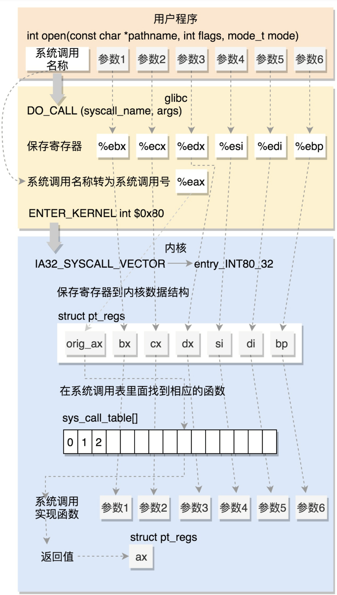
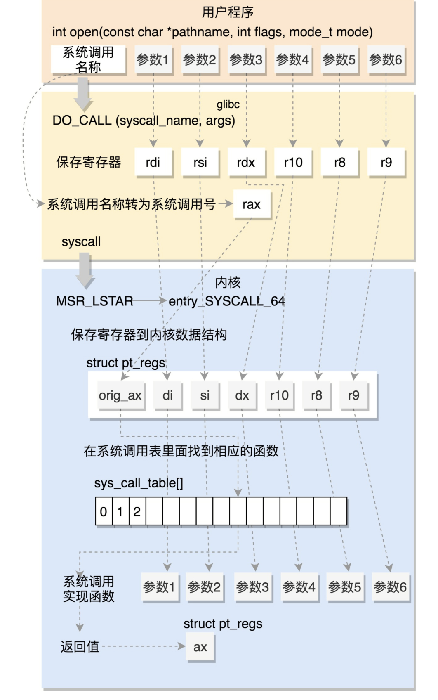

# 系统调用

```c
int open(const char *pathname, int flags, mode_t mode)
源码:
syscall.list 文件  列举着 glibc 对应的系统调用
# File name	Caller	Syscall name	Args	Strong name	Weak names
    open		-	open		Ci:siv	__libc_open __open open

make-syscall.sh 对每个封装好系统调用生成一个文件

sysdep/unix/sysdep.h

#define	SYSCALL(name, args)	PSEUDO (name, name, args)

sysdep/unix/syscall.S

#include <sysdep.h>

#ifndef SYS_syscall
#define SYS_syscall	0
#endif


SYSCALL (syscall, 1)
	ret
PSEUDO_END(syscall)


相当于

PSEUDO (syscall, syscall, args)
	ret
PSEUDO_END(syscall)


// PSEUDO
//i386
#undef	PSEUDO
#define	PSEUDO(name, syscall_name, args)				      \
  .text;								      \
  ENTRY (name)								      \
    DO_CALL (syscall_name, args);					      \
    cmpl $-4095, %eax;							      \
    jae SYSCALL_ERROR_LABEL;						      \
  L(pseudo_end):


//ia64
#undef PSEUDO
#define	PSEUDO(name, syscall_name, args)	\
  ENTRY(name)					\
    DO_CALL (SYS_ify(syscall_name));		\
	cmp.eq p6,p0=-1,r10;			\
(p6)	br.cond.spnt.few __syscall_error;


```
### 32 位的系统调用 DO_CALL
```c
/* Linux takes system call arguments in registers:

	syscall number	%eax	     call-clobbered 系统调用号码
	arg 1		%ebx	     call-saved
	arg 2		%ecx	     call-clobbered
	arg 3		%edx	     call-clobbered
	arg 4		%esi	     call-saved
	arg 5		%edi	     call-saved

   The stack layout upon entering the function is:

	20(%esp)	Arg# 5
	16(%esp)	Arg# 4
	12(%esp)	Arg# 3
	 8(%esp)	Arg# 2
	 4(%esp)	Arg# 1
	  (%esp)	Return address
*/
// linux i386
#undef	DO_CALL
#define DO_CALL(syscall_name, args)			      		      \
    PUSHARGS_##args							      \
    DOARGS_##args							      \
    movl $SYS_ify (syscall_name), %eax;					      \
    ENTER_KERNEL							      \
    POPARGS_##args

// linux i386 最初越大时 int 0x80 软中断号
#ifdef I386_USE_SYSENTER
# ifdef SHARED
#  define ENTER_KERNEL call *%gs:SYSINFO_OFFSET
# else
#  define ENTER_KERNEL call *_dl_sysinfo
# endif
#else
# define ENTER_KERNEL int $0x80 //
#endif


# define ENTER_KERNEL int $0x80 //
int $0x80 
软中断使当前线程由内核接管

```

### linux (x86)
```c
init/main.cpp

start_kernel()->trap_init();

arch/x86/kernel/traps.c
void __init trap_init(void)
{
	/* Init cpu_entry_area before IST entries are set up */
	setup_cpu_entry_areas();

	/* Init GHCB memory pages when running as an SEV-ES guest */
	sev_es_init_vc_handling();

	/* Initialize TSS before setting up traps so ISTs work */
	cpu_init_exception_handling();
	/* Setup traps as cpu_init() might #GP */
	idt_setup_traps();
	cpu_init();
}

// 注册中断
void __init idt_setup_traps(void)
{
	idt_setup_from_table(idt_table, def_idts, ARRAY_SIZE(def_idts), true);
}


def_idts 里面包含   SYSG(IA32_SYSCALL_VECTOR,	entry_INT80_32), 


// 80 中断代码 
// int 80 会触发代码执行
SYM_FUNC_START(entry_INT80_32)
	ASM_CLAC
    // eax 存储着系统调用的号码
	pushl	%eax			/* pt_regs->orig_ax */

    // 将当前用户态的数据 保存到 struct pt_regs  结构
    // 进入内核 
	SAVE_ALL pt_regs_ax=$-ENOSYS switch_stacks=1	/* save rest */ 

	movl	%esp, %eax ;
    //进入内核代码
	call	do_int80_syscall_32 


// 处理80 中断
/* Handles int $0x80 */
__visible noinstr void do_int80_syscall_32(struct pt_regs *regs)
{


	do_syscall_32_irqs_on(regs, nr);

    // .....

    //系统调用结束回到 用户模式
    syscall_exit_to_user_mode(regs);
}
/*
 * Invoke a 32-bit syscall.  Called with IRQs on in CONTEXT_KERNEL.
 */
static __always_inline void do_syscall_32_irqs_on(struct pt_regs *regs, int nr)
{
	/*
	 * Convert negative numbers to very high and thus out of range
	 * numbers for comparisons.
	 */
	unsigned int unr = nr;

	if (likely(unr < IA32_NR_syscalls)) {
		unr = array_index_nospec(unr, IA32_NR_syscalls);
		regs->ax = ia32_sys_call_table[unr](regs);//根据传入函数号执行
	} else if (nr != -1) {
		regs->ax = __ia32_sys_ni_syscall(regs);
	}
// }

// 系统调用结束返回到用户模式
__visible noinstr void syscall_exit_to_user_mode(struct pt_regs *regs)
{
	instrumentation_begin();
	__syscall_exit_to_user_mode_work(regs);
	instrumentation_end();
	__exit_to_user_mode();
}

```


### 64 位的系统调用 
```c
glibc

sysdep/unix/sysdep.h

#define	SYSCALL(name, args)	PSEUDO (name, name, args)

sysdep/unix/syscall.S

#include <sysdep.h>

#ifndef SYS_syscall
#define SYS_syscall	0
#endif


SYSCALL (syscall, 1)
	ret
PSEUDO_END(syscall)

//  sysdeps/x86_64/sysdep.h
// PSEUDO
#define	PSEUDO(name, syscall_name, args)				      \
lose:									      \
  jmp JUMPTARGET(syscall_error)						      \
  .globl syscall_error;							      \
  ENTRY (name)								      \
  DO_CALL (syscall_name, args);						      \
  jb lose


// sysdeps/unix/x86_64/sysdep.h
//DO_CALL
#define DO_CALL(syscall_name, args)					      \
  lea SYS_ify (syscall_name), %rax;					      \
  syscall


lea SYS_ify (syscall_name), %rax;		系统调用名称转换为系统调用号
x86-64 不是中断调用

syscall 指令用于系统调用--会使用到特殊模块寄存器

```
### linux (x86-64)
```c
start_kernel(){
    trap_init();
}

trap_init(){
    idt_setup_traps();//软中断表安装
    cpu_init();
}

cpu_init(){

    if (IS_ENABLED(CONFIG_X86_64)) {//x86 64
        syscall_init();
    }
}

// arch/x86/kernel/cpu/common.c
void syscall_init(void){
    wrmsrl(MSR_LSTAR, (unsigned long)entry_SYSCALL_64);
}

// rdmsr  读
// wrmsr  写
MSR_LSTAR //长模式下的特殊寄存器


syscall 从该寄存器拿出函数地址开始执行


SYM_CODE_START(entry_SYSCALL_64)

    //....
	call	do_syscall_64		/* returns with IRQs disabled */


SYM_INNER_LABEL(entry_SYSRETQ_unsafe_stack, SYM_L_GLOBAL)
	ANNOTATE_NOENDBR
	swapgs
	sysretq //返回用户态

__visible noinstr void do_syscall_64(struct pt_regs *regs, int nr)
{
	add_random_kstack_offset();
	nr = syscall_enter_from_user_mode(regs, nr);

	instrumentation_begin();

	if (!do_syscall_x64(regs, nr) && !do_syscall_x32(regs, nr) && nr != -1) {
		/* Invalid system call, but still a system call. */
		regs->ax = __x64_sys_ni_syscall(regs);
	}

	instrumentation_end();
	syscall_exit_to_user_mode(regs);
}
```


### 系统调用表
```c
arch/x86/entry/syscalls
syscall_32.tbl
5	i386	open			sys_open			compat_sys_open

syscall_64.tbl
2	common	open			sys_open


1:调用号
3:调用名字

include/linux/syscall.h 一般叫做 sysopen
```
[linux86_64系统调用](./main.c)